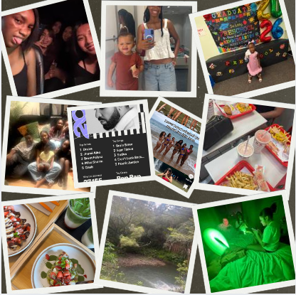

# me-in-markdown

# Dear Mr.Aiello,

Hello, my name is Rihanna Clayton. I am in the 12th grade and joined the magnet program my 10th grade year. I am the oldest child in my family, with about 5 under me. I try to challenge myself in my school life, by **taking lots and lots of AP classes my junior and senior year I have taken/are taking 5.** I also love my sport so very much and play it in different forms. I play:
 1.  high school volleyball 
 2. beach volleyball 
 3. club volleyball
4. co-ed doubles. 

My goals for this school year is to stay on top of my work and come to school everyday.

As I have already stated I love to challenge myself. My ultimate goal is just to live and do many things and that includes going into the healthcare field. I started off early and ***I am a CNA or certified nurse assistant.*** I worked this job all summer and do plan to continue during the school year. For college I want to go to a top 20, with my dream being UPenn nursing program. Even though I was already doing a lot, I also like to volunteer. I volunteer at Skilled Nursing facilities, daycares, and the library. 	

For some of my favorite things. I love to be around my friends, it is the absolute best time I have when I am with them. Whether we are doing nothing just in each other's presence or if we are going out and exploring. I also love to be with my family and I value them over everything. My family is so funny and it is always a good tim when we are all together. We already know my favorite sport but not either. My favorite show is *Johnny Test*, my favorite music genre is probably punk rock. These are just a few things about me, as the year goes on I hope you get to know more.

Sincerely,
Rihanna Clayton

[Listen to my Spotify Playlist!](https://open.spotify.com/playlist/0VDfzx2GsyLMY14E2gKPgP?si=Zw2a5vZBSGmsVkHZh5_3OQ&utm_source=copy-link&pi=wLxucMn1SIeTY) 

